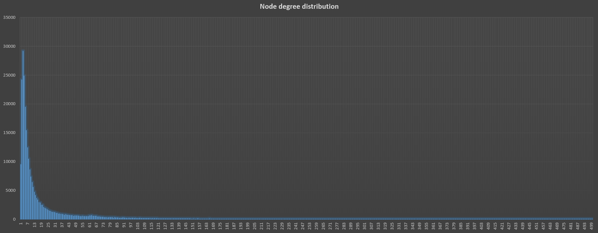

# Basic info

Nodes: 274014

Edges: 4471669

Approx. full diameter: 13 (the longest shortest path between two nodes)

90% effective diameter: 5.175473

Clustering coefficient: 0.566830452965

# Node degree distribution

As we can see node degree distribution indicates a scale-free network

# Counts of components for each size

| Component size | Count         | Component size | Count         |
| -------------- |:-------------:| -------------- |:-------------:|
| 1              | 9512          | 10             | 11            |
| 2              | 2104          | 11             | 11            |
| 3              | 872           | 12             | 4             |
| 4              | 356           | 13             | 2             |
| 5              | 164           | 14             | 2             |
| 6	             | 73            | 15             | 1             |
| 7              | 46            | 16             | 1             |
| 8              | 20            | 17             | 1             |
|                |               | 254106         |	1             |

As we can see we have a plethora of small components and one big component which contains ~93% of all authors.

